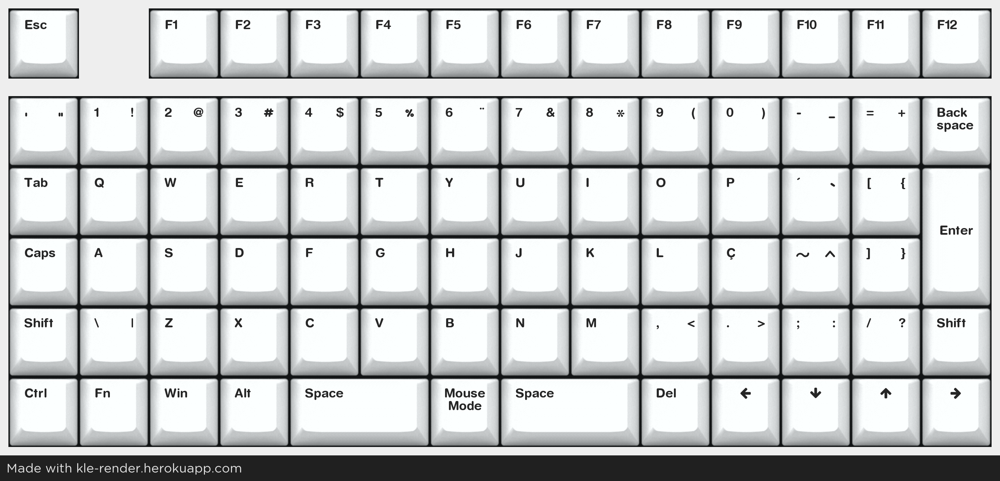

# OrthoNT

An open-source, QMK-compatible, (loosely) ABNT2-based 6x14 ortholinear keyboard.

---

Layout:

Links: [KLE](http://www.keyboard-layout-editor.com/#/gists/c8b4991d1be04ef7142aadfa52a7956e), [JSON](https://gist.github.com/ManoShu/c8b4991d1be04ef7142aadfa52a7956e), [QMK](https://github.com/ManoShu/OrthoNT/tree/main/qmk/keyboards/handwired/orthont)

---

## PCB & Plate
The gerber files are under `production`. They had been used and confirmed to work, however use them at your own risk.

## QMK

No plan to integrate to the main QMK repository yet, as I am waiting for a proper VID/PID allocation. The files are on the `qmk` directory; just copy folder to qmk and it should work (HOWEVER the files have been confirmed working on QMK 0.2.2 [check yours with `qmk --version`], previous versions might not have support for some of the tags in the` info.json` file).

## VIA / VIAL

**NOTE: VIA / VIAL files have not been uploaded yet**

A `via` keymap is available allowing to use VIA to change keybindings withou the need to setup QMK. 
It is not integrated with the official repository yet (as I am waiting for a proper VID allocation), but the .json file required to change bindings is available on the `via` directory.

A VIAL-compatible keymap is also available. Drop the keyboard folder to your `vial-qmk` directory and it should also work right off the bat.